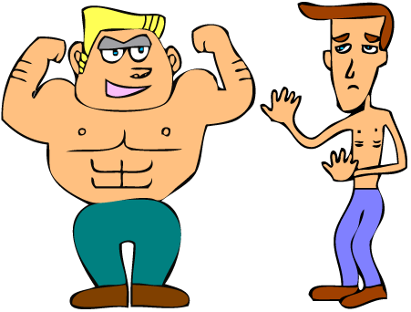

Title: The tortoise and the hare move house
Date: 2015-07-14
Author: Duncan Garmonsway
Summary: Is carrying two boxes at a time slowly faster than carrying one box quickly?
Disqus_identifier: tortoise
og_image: ./images/451px-strong-vs-weak-clip-art-1502408.gif

Someone in my flat emigrated last week, leaving behind 13 boxes for the shipping
company.  When the van man arrived and saw the 40 steps leading up to our flat,
he nearly passed out.  I offered to help.

The van man man and I are different builds.

While the strong van man carried two boxes at a time down the steps, I carred
only one, and then ran back up for another.  The final score was seven to him,
and six to me.  How did I keep up?  Without being unkind, the van man's strength
came with bulk.  Taking his own body into account, he carried a lot more than I
did, half of the journeys *up* the steps.

It would be interesting to find out how well animal bodies optimise themselves
for physical exertion.  If a professional house mover is on a healthy diet, does
their strength and bulk tend towards an optimum solution of the strength/bulk
trade-off?  Anyone know?
